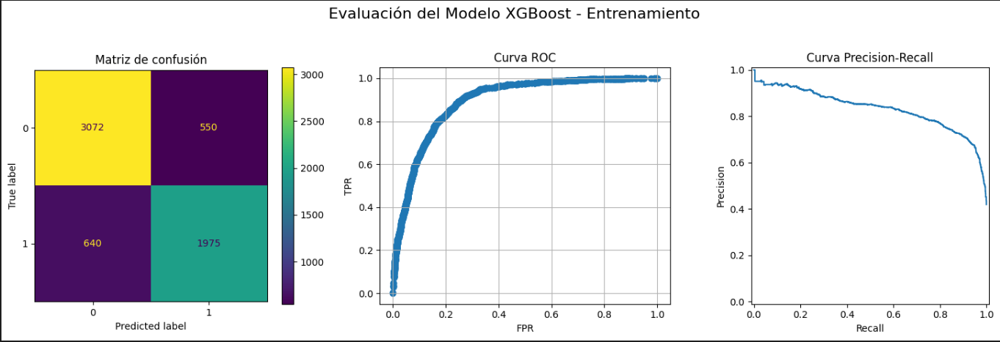
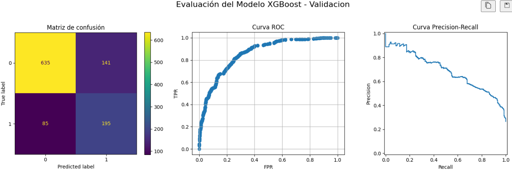
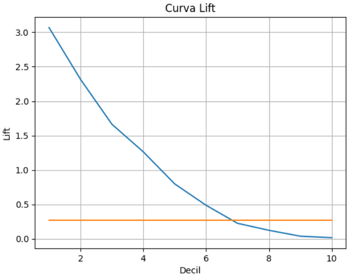

# Telecom Customer Churn Prediction

## Project Description

This project presents the development of a machine learning model to predict customer churn for a telecommunications company. Multiple datasets containing information about customer contracts, services, and personal details were combined and processed.

The project follows a complete workflow including data cleaning, preprocessing, model training, optimization, and pipeline creation for future data prediction. Additionally, a **lift curve analysis** was performed to identify the customers most likely to churn, allowing for targeted retention offers.

## Process Overview

1. **Data Cleaning**:

   - Standardized column names.
   - Corrected data types for dates and numeric features.
   - Addressed columns with empty spaces.

2. **Data Preprocessing**:

   - Merged all datasets into a unified dataframe.
   - Performed exploratory data analysis (EDA).
   - Split data into training, validation, and test sets.
   - Encoded categorical and boolean features.
   - Balanced the classes.
   - Created different datasets: balanced, unbalanced, full, and feature-selected.

3. **Model Training**:

   - Evaluation metrics: **F1 Score** and **AUC-ROC**.
   - Trained various models: **Logistic Regression**, **Random Forest**, **CatBoost**, **LightGBM**, and **XGBoost**.
   - Focused on decision-tree-based and gradient-boosting models for their efficiency with binary feature data.

4. **Model Optimization**:
   - Feature selection using Random Forest importance.
   - Hyperparameter tuning via **GridSearch**.
   - Final model evaluation on the test set.
   - Creation of a processing pipeline for new data.

## Final Model

The final model selected is an **XGBoost Classifier**. It was optimized through hyperparameter tuning and feature selection to achieve robust performance across validation and test datasets.

## - Final Results:

A lift curve analysis was conducted to determine how much better the model was compared to random selection. It was found that selecting the top 10% of customers most likely to churn (as predicted by the model) yielded six times more positive churn predictions than random selection.

**Model Performance**:

- **F1 Score**: 0.69 - 0.71
- **AUC-ROC**: 0.78 - 0.80

By selecting the top 10% of customers most likely to churn, the model predicts with approximately **81% certainty** that these customers would leave the company without intervention, enabling targeted retention strategies.

## Tools and Libraries

Find them in requirements.txt

## Prediction Pipeline

For making new predictions, a processing pipeline has been created in the file **pipeline/pp_01_execution.py**.  
To use it, you must provide the four datasets (contracts, internet, phone, and personal) structured similarly to the original format in the folder **pipeline/data/**.  
By calling the function **exe(num_clients)**, the script will preprocess the data and output the predictions directly to the console, replace the variable num_clients with the number es clients that you want to have as the most possible to chrun.
